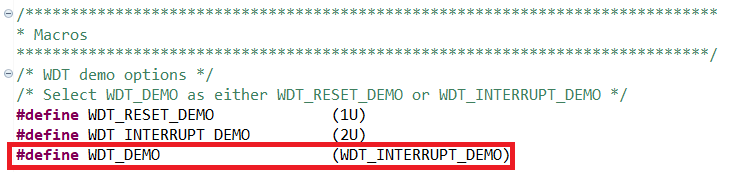
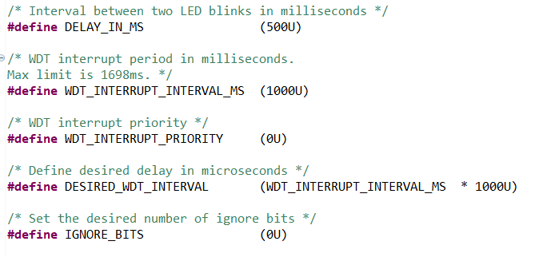

# PSoC&trade; 4: Watchdog timer interrupt and reset

This code example deals with the watchdog timer (WDT) of PSoC&trade; 4. The watchdog timer operates in two modes: the interrupt mode and the reset mode. In the interrupt mode, the LED toggles every second. When configured in the reset mode, the LED blinks thrice every 4.915 seconds with an interval of 500 milliseconds due to the watchdog resets. In idle mode, the system enters deep sleep mode to save power.

All the intervals used in this code example are configurable.

[View this README on GitHub.](https://github.com/Infineon/mtb-example-psoc4-wdt)

[Provide feedback on this code example.](https://cypress.co1.qualtrics.com/jfe/form/SV_1NTns53sK2yiljn?Q_EED=eyJVbmlxdWUgRG9jIElkIjoiQ0UyMzA2NTMiLCJTcGVjIE51bWJlciI6IjAwMi0zMDY1MyIsIkRvYyBUaXRsZSI6IlBTb0MmdHJhZGU7IDQ6IFdhdGNoZG9nIHRpbWVyIGludGVycnVwdCBhbmQgcmVzZXQiLCJyaWQiOiJib29wYWxhbXNyaW4iLCJEb2MgdmVyc2lvbiI6IjIuMS4wIiwiRG9jIExhbmd1YWdlIjoiRW5nbGlzaCIsIkRvYyBEaXZpc2lvbiI6Ik1DRCIsIkRvYyBCVSI6IklDVyIsIkRvYyBGYW1pbHkiOiJQU09DIn0=)

## Requirements

- [ModusToolbox&trade;](https://www.infineon.com/modustoolbox) v3.1 or later (tested with v3.1)
- Board support package (BSP) minimum required version: 3.1.0
- Programming language: C
- Associated parts: [PSoC&trade; 4000S, PSoC&trade; 4100S, PSoC&trade; 4100S Plus, PSoC&trade; 4500S, PSoC&trade; 4100S Max, and PSoC&trade; 4000T](https://www.infineon.com/cms/en/product/microcontroller/32-bit-psoc-arm-cortex-microcontroller/psoc-4-32-bit-arm-cortex-m0-mcu/)

## Supported toolchains (make variable 'TOOLCHAIN')

- GNU Arm&reg; Embedded Compiler v11.3.1 (`GCC_ARM`) – Default value of `TOOLCHAIN`
- Arm&reg; Compiler v6.16 (`ARM`)
- IAR C/C++ Compiler v9.30.1 (`IAR`)

## Supported kits (make variable 'TARGET')

- [PSoC&trade; 4100S Max Pioneer Kit](https://www.infineon.com/CY8CKIT-041S-MAX) (`CY8CKIT-041S-MAX`) - Default value of `TARGET`
- [PSoC&trade; 4100S Plus Prototyping Kit](https://www.infineon.com/CY8CKIT-149) (`CY8CKIT-149`)
- [PSoC&trade; 4000S CAPSENSE&trade; Prototyping Kit](https://www.infineon.com/CY8CKIT-145-40XX) (`CY8CKIT-145-40XX`)
- [PSoC&trade; 4100S CAPSENSE&trade; Pioneer Kit](https://www.infineon.com/CY8CKIT-041-41XX) (`CY8CKIT-041-41XX`)
- [PSoC&trade; 4500S Pioneer Kit](https://www.infineon.com/CY8CKIT-045S) (`CY8CKIT-045S`)
- [PSoC&trade; 4000T CAPSENSE&trade; Prototyping Kit](https://www.infineon.com/CY8CPROTO-040T) (`CY8CPROTO-040T`)
- [PSoC&trade; 4000T CAPSENSE&trade; Evaluation Kit](https://www.infineon.com/CY8CKIT-040T) (`CY8CKIT-040T`)


## Hardware setup

This example uses the board's default configuration. See the kit user guide to ensure that the board is configured correctly.

> **Note:** Some of the PSoC&trade; 4 kits ship with KitProg2 installed. ModusToolbox&trade; requires KitProg3. Before using this code example, make sure that the board is upgraded to KitProg3. The tool and instructions are available in the [Firmware Loader](https://github.com/Infineon/Firmware-loader) GitHub repository. If you do not upgrade, you will see an error like "unable to find CMSIS-DAP device" or "KitProg firmware is out of date".

## Software setup

See the [ModusToolbox&trade; tools package installation guide](https://www.infineon.com/ModusToolboxInstallguide) for information about installing and configuring the tools package.

This example requires no additional software or tools.

## Using the code example

### Create the project

The ModusToolbox&trade; tools package provides the Project Creator as both a GUI tool and a command line tool.

<details><summary><b>Use Project Creator GUI</b></summary>

1. Open the Project Creator GUI tool.

   There are several ways to do this, including launching it from the dashboard or from inside the Eclipse IDE. For more details, see the [Project Creator user guide](https://www.infineon.com/ModusToolboxProjectCreator) (locally available at *{ModusToolbox&trade; install directory}/tools_{version}/project-creator/docs/project-creator.pdf*).

2. On the **Choose Board Support Package (BSP)** page, select a kit supported by this code example. See [Supported kits](#supported-kits-make-variable-target).
   > **Note:** To use this code example for a kit not listed here, you may need to update the source files. If the kit does not have the required resources, the application may not work.

3. On the **Select Application** page:

   a. Select the **Applications(s) Root Path** and the **Target IDE**.

   > **Note:** Depending on how you open the Project Creator tool, these fields may be pre-selected for you.

   b.	Select this code example from the list by enabling its check box.

   > **Note:** You can narrow the list of displayed examples by typing in the filter box.

   c. (Optional) Change the suggested **New Application Name** and **New BSP Name**.

   d. Click **Create** to complete the application creation process.

</details>

<details><summary><b>Use Project Creator CLI</b></summary>

The 'project-creator-cli' tool can be used to create applications from a CLI terminal or from within batch files or shell scripts. This tool is available in the *{ModusToolbox&trade; install directory}/tools_{version}/project-creator/* directory.

Use a CLI terminal to invoke the 'project-creator-cli' tool. On Windows, use the command-line 'modus-shell' program provided in the ModusToolbox&trade; installation instead of a standard Windows command-line application. This shell provides access to all ModusToolbox&trade; tools. You can access it by typing "modus-shell" in the search box in the Windows menu. In Linux and macOS, you can use any terminal application.

The following example clones the "[mtb-example-psoc4-wdt](https://github.com/Infineon/mtb-example-psoc4-wdt)" application with the desired name "Psoc4Wdt" configured for the *CY8CKIT-149* BSP into the specified working directory, *C:/mtb_projects*:

   ```
   project-creator-cli --board-id CY8CKIT-149 --app-id mtb-example-psoc4-wdt --user-app-name Psoc4Wdt --target-dir "C:/mtb_projects"
   ```

The 'project-creator-cli' tool has the following arguments:

Argument | Description | Required/optional
---------|-------------|-----------
`--board-id` | Defined in the <id> field of the [BSP](https://github.com/Infineon?q=bsp-manifest&type=&language=&sort=) manifest | Required
`--app-id`   | Defined in the <id> field of the [CE](https://github.com/Infineon?q=ce-manifest&type=&language=&sort=) manifest | Required
`--target-dir`| Specify the directory in which the application is to be created if you prefer not to use the default current working directory | Optional
`--user-app-name`| Specify the name of the application if you prefer to have a name other than the example's default name | Optional

> **Note:** The project-creator-cli tool uses the `git clone` and `make getlibs` commands to fetch the repository and import the required libraries. For details, see the "Project creator tools" section of the [ModusToolbox&trade; tools package user guide](https://www.infineon.com/ModusToolboxUserGuide) (locally available at {ModusToolbox&trade; install directory}/docs_{version}/mtb_user_guide.pdf).


</details>

### Open the project

After the project has been created, you can open it in your preferred development environment.

<details><summary><b>Eclipse IDE</b></summary>


If you opened the Project Creator tool from the included Eclipse IDE, the project will open in Eclipse automatically.

For more details, see the [Eclipse IDE for ModusToolbox&trade; user guide](https://www.infineon.com/MTBEclipseIDEUserGuide) (locally available at *{ModusToolbox&trade; install directory}/docs_{version}/mt_ide_user_guide.pdf*).

</details>


<details><summary><b>Visual Studio (VS) Code</b></summary>

Launch VS Code manually, and then open the generated *{project-name}.code-workspace* file located in the project directory.

For more details, see the [Visual Studio Code for ModusToolbox&trade; user guide](https://www.infineon.com/MTBVSCodeUserGuide) (locally available at *{ModusToolbox&trade; install directory}/docs_{version}/mt_vscode_user_guide.pdf*).

</details>


<details><summary><b>Keil µVision</b></summary>

Double-click the generated *{project-name}.cprj* file to launch the Keil µVision IDE.

For more details, see the [Keil µVision for ModusToolbox&trade; user guide](https://www.infineon.com/MTBuVisionUserGuide) (locally available at *{ModusToolbox&trade; install directory}/docs_{version}/mt_uvision_user_guide.pdf*).

</details>

<details><summary><b>IAR Embedded Workbench</b></summary>

Open IAR Embedded Workbench manually, and create a new project. Then select the generated *{project-name}.ipcf* file located in the project directory.

For more details, see the [IAR Embedded Workbench for ModusToolbox&trade; user guide](https://www.infineon.com/MTBIARUserGuide) (locally available at *{ModusToolbox&trade; install directory}/docs_{version}/mt_iar_user_guide.pdf*).

</details>

<details><summary><b>Command line</b></summary>


If you prefer to use the CLI, open the appropriate terminal, and navigate to the project directory. On Windows, use the command-line 'modus-shell' program; on Linux and macOS, you can use any terminal application. From there, you can run various `make` commands.

For more details, see the [ModusToolbox&trade; tools package user guide](https://www.infineon.com/ModusToolboxUserGuide) (locally available at *{ModusToolbox&trade; install directory}/docs_{version}/mtb_user_guide.pdf*).

</details>


## Operation

1. Connect the board to your PC using the provided USB cable through the KitProg3 USB connector.

2. By default, the code example works in WDT interrupt mode because the macro `WDT_DEMO` in main.c is set as `WDT_INTERRUPT_DEMO`. To make the WDT work in the reset mode, set the `WDT_DEMO` macro to `WDT_RESET_DEMO` in *main.c* as Figure 1 shows.

   **Figure 1. Accessing WDT operation modes**

   


3. Program the board using one of the following:

   <details><summary><b>Using Eclipse IDE</b></summary>

      1. Select the application project in the Project Explorer.

      2. In the **Quick Panel**, scroll down, and click **\<Application Name> Program (KitProg3_MiniProg4)**.

   </details>

   <details><summary><b>In other IDEs</b></summary>

   Follow the instructions in your preferred IDE.
   </details>


   <details><summary><b>Using CLI</b></summary>

     From the terminal, execute the `make program` command to build and program the application using the default toolchain to the default target. The default toolchain is specified in the application's Makefile but you can override this value manually:
      ```
      make program TOOLCHAIN=<toolchain>
      ```

      Example:
      ```
      make program TOOLCHAIN=GCC_ARM
      ```
   </details>

4. Observe the status of LED based on different events summarized as follows:

**Table 1. LED status based on the macro `WDT_DEMO`**

 Project setting  |  LED status
 :------- | :------------
 `WDT_DEMO` set to `WDT_INTERRUPT_DEMO` | LED toggles on every WDT interrupt (interval of 1 s).
 `WDT_DEMO` set to `WDT_RESET_DEMO` with the blocking function   | After approximately 5 s, the device resets and the LED blinks thrice with a 500-ms interval to indicate a WDT reset.

The LED blinks once on a power cycle or an external reset event.

**Note:** The LED states are inverted for the CY8CKIT-149 kit. Macros `LED_STATE_ON` and `LED_STATE_OFF` have to be updated in main.c.

## Debugging

You can debug the example to step through the code.


<details><summary><b>In Eclipse IDE</b></summary>

Use the **\<Application Name> Debug (KitProg3_MiniProg4)** configuration in the **Quick Panel**. For details, see the "Program and debug" section in the [Eclipse IDE for ModusToolbox&trade; user guide](https://www.infineon.com/MTBEclipseIDEUserGuide).

</details>


<details><summary><b>In other IDEs</b></summary>

Follow the instructions in your preferred IDE.
</details>


## Design and implementation

The WDT in PSoC&trade; 4 is a 16-bit timer and uses the internal low-speed oscillator (ILO) clock of 40-kHz as a source.
The accuracy of ILO is (- 50% to +100%). Therefore, the match value of WDT is set after compensating the ILO with IMO.
The firmware flow is as follows:

1. Set the 'ignore' bits for the WDT counter. In this project, it is set to '0'. This means that the counter works with full 16-bit resolution. This gives an interval of 1.6384 s (65536 ÷ 40 kHz) for the complete count. See the device architecture [TRM](https://www.infineon.com/dgdl/Infineon-PSoC_4100S_and_PSoC_4100S_Plus_PSoC_4_Architecture_TRM-AdditionalTechnicalInformation-v12_00-EN.pdf?fileId=8ac78c8c7d0d8da4017d0f9433460188) Chapter 13. "Watchdog Timer" for more information.

2. Clear the pending WDT interrupt.

3. Enable the ILO, which is the source for the WDT. Start ILO measurement and get the value of `ilo_compensated_counts` that requires to be set after every interrupt match.

4. Write the match value. The WDT can generate an interrupt when the WDT counter reaches the match count. The match count is generated using `DESIRED_WDT_INTERVAL`.

5. For the interrupt mode, enable interrupt generation and assign the interrupt service routine(`wdt_isr`).

6. Enable the WDT.

7. Because the ILO has low accuracy, the `ilo_compensated_counts` are calculated and the match value of the WDT is updated following a WDT interrupt.

8.    The System is put into Deep Sleep in idle mode to save power. Because the watchdog timer works on a low-frequency clock (LFCLK), its operation will not be effected when the system is put into Deep Sleep mode. The watchdog timer interrupt will wake the device from Deep Sleep mode.


**Notes:**

1. In interrupt mode, the WDT is configured to generate interrupts at `WDT_INTERRUPT_INTERVAL_MS` intervals. The default value of `WDT_INTERRUPT_INTERVAL_MS` is 1000 milliseconds. The WDT generates an interrupt on reaching the match value. The WDT counter is not reset on match; it continues to count across the full 16-bit resolution. Therefore, the new match value of the WDT counter is generated and updated on every WDT interrupt event to generate an interrupt after one second from the present interrupt. The WDT interrupt flag is set inside the WDT interrupt service routine; it is checked in the main loop and the LED on the kit is toggled.

2. In reset mode, the WDT is enabled without configuring the ISR and interrupt interval. To demonstrate WDT reset, a blocking code `(while(1))` is present in the innermost `for` loop, which is enabled when `WDT_DEMO` is selected as `WDT_RESET_DEMO`. The firmware must clear the WDT interrupt before the third match event/interrupt. For normal applications, `Cy_WDT_ClearInterrupt()` should be called to clear the WDT interrupt before the timeout (3 * WDT counter time period) is reached. However, when `WDT_DEMO` is set as `WDT_RESET_DEMO`, the firmware will not clear the interrupt. Therefore, the WDT interrupt is not served, which leads to a device reset on the third interrupt.  The default reset interval is 4.915 seconds (= 3 * 1.685). It can be reduced by increasing the value of ignore bits in the `IGNORE_BITS` macro.

3. Because the ILO has low accuracy (-50% to +100%), `ilo_compensated_counts` needs to be periodically calculated using the IMO (+/- 2%).

4. Upon every device reset, the firmware checks whether the reset event is caused by the WDT. If a reset event occurred due to the WDT, the LED blinks thrice with an interval of `DELAY_IN_MS`. If not, it will blink once with the interval of `DELAY_IN_MS`.

5. You can configure the values of the WDT interrupt interval, LED Blink interval, WDT interrupt priority, and a number of ignore bits using macros in *main.c* as shown in Figure 2 and update them.

   **Figure 2. Accessing macros**

   

### Resources and settings

**Table 2. Application resources**

 Resource  |  Alias/object     |    Purpose
 :------- | :------------    | :------------
 WDT (PDL) | -          | WDT driver to configure the hardware resource
 GPIO (PDL)    | CYBSP_USER_LED         | LED

<br>

## Related resources

Resources  | Links
-----------|----------------------------------
Application notes  | [AN79953](https://www.infineon.com/AN79953) – Getting started with PSoC&trade; 4
Code examples  | [Using ModusToolbox&trade;](https://github.com/Infineon/Code-Examples-for-ModusToolbox-Software) on GitHub 
Device documentation | [PSoC&trade; 4 datasheets](https://www.infineon.com/cms/en/search.html#!view=downloads&term=psoc4&doc_group=Data%20Sheet) <br>[PSoC&trade; 4 technical reference manuals](https://www.infineon.com/cms/en/search.html#!view=downloads&term=psoc4&doc_group=Additional%20Technical%20Information)
Development kits | Select your kits from the [Evaluation board finder](https://www.infineon.com/cms/en/design-support/finder-selection-tools/product-finder/evaluation-board) page.
Libraries on GitHub | [mtb-pdl-cat2](https://github.com/Infineon/mtb-pdl-cat2) – PSoC&trade; 4 Peripheral Driver Library (PDL)<br> [mtb-hal-cat2](https://github.com/Infineon/mtb-hal-cat2) – Hardware Abstraction Layer (HAL) library
Tools  | [ModusToolbox&trade;](https://www.infineon.com/modustoolbox) – ModusToolbox&trade; software is a collection of easy-to-use libraries and tools enabling rapid development with Infineon MCUs for applications ranging from wireless and cloud-connected systems, edge AI/ML, embedded sense and control, to wired USB connectivity using PSoC&trade; Industrial/IoT MCUs, AIROC&trade; Wi-Fi and Bluetooth&reg; connectivity devices, XMC&trade; Industrial MCUs, and EZ-USB&trade;/EZ-PD&trade; wired connectivity controllers. ModusToolbox&trade; incorporates a comprehensive set of BSPs, HAL, libraries, configuration tools, and provides support for industry-standard IDEs to fast-track your embedded application development.

<br>

## Other resources

Infineon provides a wealth of data at [www.infineon.com](https://www.infineon.com) to help you select the right device, and quickly and effectively integrate it into your design.

## Document history

Document title: *CE230653* - *PSoC&trade; 4: Watchdog timer interrupt and reset*

 Version | Description of change
 ------- | ---------------------
 1.0.0   | New code example. <br />  This version is not backward compatible with ModusToolbox&trade; software v2.1.
 1.1.0   | Added support for new kits
 2.0.0   | Major update to support ModusToolbox&trade; v3.0. <br> This version is not backward compatible with previous versions of ModusToolbox&trade; software.
 2.1.0   | Added support for new kits and updated to support ModusToolbox&trade; v3.1.

<br>
---------------------------------------------------------

© Cypress Semiconductor Corporation, 2020-2023. This document is the property of Cypress Semiconductor Corporation, an Infineon Technologies company, and its affiliates ("Cypress").  This document, including any software or firmware included or referenced in this document ("Software"), is owned by Cypress under the intellectual property laws and treaties of the United States and other countries worldwide.  Cypress reserves all rights under such laws and treaties and does not, except as specifically stated in this paragraph, grant any license under its patents, copyrights, trademarks, or other intellectual property rights.  If the Software is not accompanied by a license agreement and you do not otherwise have a written agreement with Cypress governing the use of the Software, then Cypress hereby grants you a personal, non-exclusive, nontransferable license (without the right to sublicense) (1) under its copyright rights in the Software (a) for Software provided in source code form, to modify and reproduce the Software solely for use with Cypress hardware products, only internally within your organization, and (b) to distribute the Software in binary code form externally to end users (either directly or indirectly through resellers and distributors), solely for use on Cypress hardware product units, and (2) under those claims of Cypress's patents that are infringed by the Software (as provided by Cypress, unmodified) to make, use, distribute, and import the Software solely for use with Cypress hardware products.  Any other use, reproduction, modification, translation, or compilation of the Software is prohibited.
<br>
TO THE EXTENT PERMITTED BY APPLICABLE LAW, CYPRESS MAKES NO WARRANTY OF ANY KIND, EXPRESS OR IMPLIED, WITH REGARD TO THIS DOCUMENT OR ANY SOFTWARE OR ACCOMPANYING HARDWARE, INCLUDING, BUT NOT LIMITED TO, THE IMPLIED WARRANTIES OF MERCHANTABILITY AND FITNESS FOR A PARTICULAR PURPOSE.  No computing device can be absolutely secure.  Therefore, despite security measures implemented in Cypress hardware or software products, Cypress shall have no liability arising out of any security breach, such as unauthorized access to or use of a Cypress product. CYPRESS DOES NOT REPRESENT, WARRANT, OR GUARANTEE THAT CYPRESS PRODUCTS, OR SYSTEMS CREATED USING CYPRESS PRODUCTS, WILL BE FREE FROM CORRUPTION, ATTACK, VIRUSES, INTERFERENCE, HACKING, DATA LOSS OR THEFT, OR OTHER SECURITY INTRUSION (collectively, "Security Breach").  Cypress disclaims any liability relating to any Security Breach, and you shall and hereby do release Cypress from any claim, damage, or other liability arising from any Security Breach.  In addition, the products described in these materials may contain design defects or errors known as errata which may cause the product to deviate from published specifications. To the extent permitted by applicable law, Cypress reserves the right to make changes to this document without further notice. Cypress does not assume any liability arising out of the application or use of any product or circuit described in this document. Any information provided in this document, including any sample design information or programming code, is provided only for reference purposes.  It is the responsibility of the user of this document to properly design, program, and test the functionality and safety of any application made of this information and any resulting product.  "High-Risk Device" means any device or system whose failure could cause personal injury, death, or property damage.  Examples of High-Risk Devices are weapons, nuclear installations, surgical implants, and other medical devices.  "Critical Component" means any component of a High-Risk Device whose failure to perform can be reasonably expected to cause, directly or indirectly, the failure of the High-Risk Device, or to affect its safety or effectiveness.  Cypress is not liable, in whole or in part, and you shall and hereby do release Cypress from any claim, damage, or other liability arising from any use of a Cypress product as a Critical Component in a High-Risk Device. You shall indemnify and hold Cypress, including its affiliates, and its directors, officers, employees, agents, distributors, and assigns harmless from and against all claims, costs, damages, and expenses, arising out of any claim, including claims for product liability, personal injury or death, or property damage arising from any use of a Cypress product as a Critical Component in a High-Risk Device. Cypress products are not intended or authorized for use as a Critical Component in any High-Risk Device except to the limited extent that (i) Cypress's published data sheet for the product explicitly states Cypress has qualified the product for use in a specific High-Risk Device, or (ii) Cypress has given you advance written authorization to use the product as a Critical Component in the specific High-Risk Device and you have signed a separate indemnification agreement.
<br>
Cypress, the Cypress logo, and combinations thereof, ModusToolbox, PSoC, CAPSENSE, EZ-USB, F-RAM, and TRAVEO are trademarks or registered trademarks of Cypress or a subsidiary of Cypress in the United States or in other countries. For a more complete list of Cypress trademarks, visit www.infineon.com. Other names and brands may be claimed as property of their respective owners.
